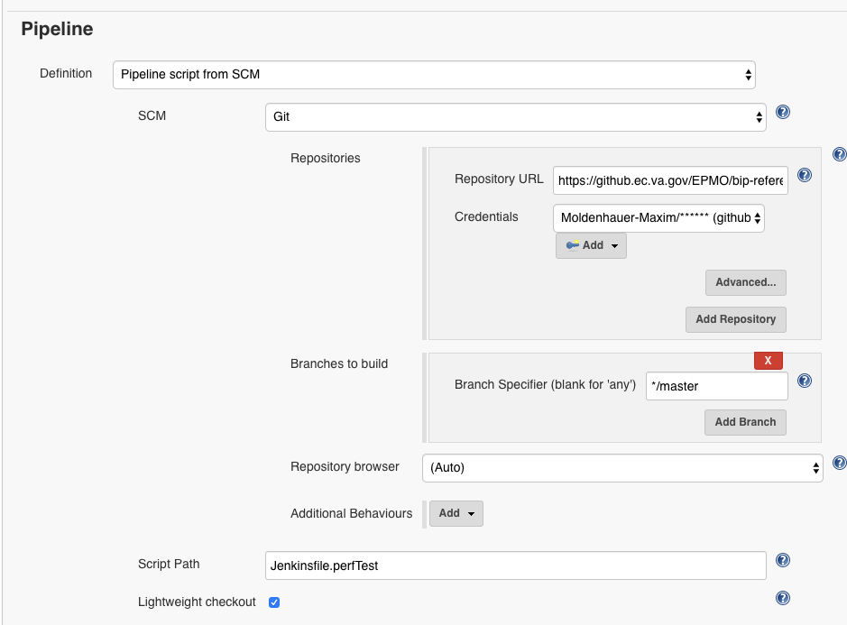
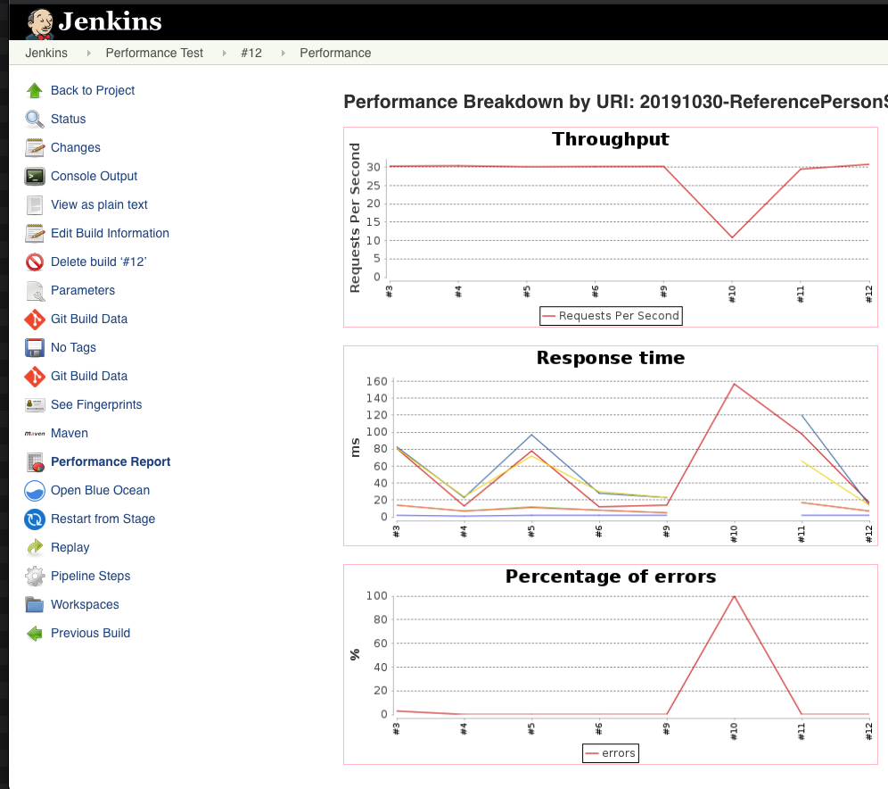

## What is this project for?
This document provides details for **Reference Person Service Performance Testing**. The project is an example and demonstration for how to set up functioning performance tests.

## Performance tests for Reference Person Service
Performance tests are executed to guage if the application would be able to handle a reasonable request load.

The project uses Apache JMeter.

It is recommended that JMeter GUI mode be used for developing tests, and command mode (command-line execution) for test execution.

## Project Structure

`pom.xml` - The Maven configuration for building and deploying the project.

`src/test/jmeter` - Performance testing configurations (jmx files) go in this directory.

## Execution

Testing executes requests against the rest end points available in Reference Person Service:
- PID based Person Info from Person Partner Service - `/api/v1/persons/pid`
- Person service Health check endpoint - `/api/v1/persons/health`

Every request must contain a valid JWT header, so every test calls the `/token` end point to generate a JWT token for the user.

## Performance Test Configuration

The test suite can be configured to:
- execute each test a different number of times.
- execute each test with different number of threads.

Below is an example of typical configuration values. To override any of the properties, pass them on the command line as `-D` arguments, e.g. `-Ddomain=(env)`.

|Property|Description|Default Value|Perf Env Test Values|
|-|-|-|-|
|domain| Reference Person service Base Url|localhost| |
|port|Reference Person Service Port|8080|443 |
|protocol|Reference Person Service Protocol|http|https |
|jMeterTestFile|The test file(s) targeted for the run. Regex accepted|\*.jmx|\*.jmx|
|PersonHealth.threadGroup.threads|Number of threads for Health Status|5|150|
|PersonHealth.threadGroup.rampUp|Thead ramp up|2|150|
|PersonHealth.threadGroup.loopCount|Number of executions|10|-1|
|PersonHealth.threadGroup.duration|Scheduler Duration in seconds|200|230|
|PersonHealth.threadGroup.startUpDelay|Delay to Start|5|30|
|PersonInfo.threadGroup.threads|Number of threads for PID based Person Info|5|150|
|PersonInfo.threadGroup.rampUp|Thead ramp up|2|150|
|PersonInfo.threadGroup.loopCount|Number of executions|10|-1|
|PersonInfo.threadGroup.duration|Scheduler Duration in seconds|200|230|
|PersonInfo.threadGroup.startUpDelay|Delay to Start|2|30|
|PersonInfoNoRecordFound.threadGroup.threads|Number of threads PID based Person Info with No Record Found PID|5|150|
|PersonInfoNoRecordFound.threadGroup.rampUp|Thead ramp up|2|150|
|PersonInfoNoRecordFound.threadGroup.loopCount|Number of executions |10|-1|
|PersonInfoNoRecordFound.threadGroup.duration|Scheduler Duration in seconds|200|230|
|PersonInfoNoRecordFound.threadGroup.startUpDelay|Delay to Start|2|30|
|PersonInfoInvalidPid.threadGroup.threads|Number of threads PID based Person Info with Invalid PID|5|150|
|PersonInfoInvalidPid.threadGroup.rampUp|Thead ramp up|2|150|
|PersonInfoInvalidPid.threadGroup.loopCount|Number of executions |10|-1|
|PersonInfoInvalidPid.threadGroup.duration|Scheduler Duration in seconds|200|230|
|PersonInfoInvalidPid.threadGroup.startUpDelay|Delay to Start|2|30|
|PersonInfoNullPid.threadGroup.threads|Number of threads PID based Person Info with null PID|5|150|
|PersonInfoNullPid.threadGroup.rampUp|Thead ramp up|2|150|
|PersonInfoNullPid.threadGroup.loopCount|Number of executions |10|-1|
|PersonInfoNullPid.threadGroup.duration|Scheduler Duration in seconds|200|230|
|PersonInfoNullPid.threadGroup.startUpDelay|Delay to Start|2|30|
|BearerTokenCreate.threadGroup.threads|Number of threads for Bearer Token Create/Generate|5|150|
|BearerTokenCreate.threadGroup.rampUp|Thead ramp up|1|50|
|BearerTokenCreate.threadGroup.loopCount|Number of executions |1|1|

## Running the tests

To execute performance tests locally, navigate to the `bip-reference-perftest` directory, and run
```bash
mvn clean verify -Pperftest
```
If you need to override any of the properties add the to the command using the appropriate `-Dpropety=value` argument(s).

#### Sample Command
An example for executing the test in performance test environment: 

```bash
mvn clean verify -Pperftest -Dprotocol=<> -Ddomain=<> -Dport=<> -DBearerTokenCreate.threadGroup.threads=150 -DBearerTokenCreate.threadGroup.rampUp=50 -DBearerTokenCreate.threadGroup.loopCount=1 -DPersonHealth.threadGroup.threads=150 -DPersonHealth.threadGroup.rampUp=150 -DPersonHealth.threadGroup.loopCount=-1 -DPersonHealth.threadGroup.duration=230 -DPersonHealth.threadGroup.startUpDelay=30 -DPersonInfo.threadGroup.threads=150 -DPersonInfo.threadGroup.rampUp=150 -DPersonInfo.threadGroup.loopCount=-1 -DPersonInfo.threadGroup.duration=230 -DPersonInfo.threadGroup.startUpDelay=30 -DPersonInfoNoRecordFound.threadGroup.threads=150 -DPersonInfoNoRecordFound.threadGroup.rampUp=150 -DPersonInfoNoRecordFound.threadGroup.loopCount=-1 -DPersonInfoNoRecordFound.threadGroup.duration=230 -DPersonInfoNoRecordFound.threadGroup.startUpDelay=30 -DPersonInfoInvalidPid.threadGroup.threads=150 -DPersonInfoInvalidPid.threadGroup.rampUp=150 -DPersonInfoInvalidPid.threadGroup.loopCount=-1 -DPersonInfoInvalidPid.threadGroup.duration=230 -DPersonInfoInvalidPid.threadGroup.startUpDelay=30 -DPersonInfoNullPid.threadGroup.threads=150 -DPersonInfoNullPid.threadGroup.rampUp=150 -DPersonInfoNullPid.threadGroup.loopCount=-1 -DPersonInfoNullPid.threadGroup.duration=230 -DPersonInfoNullPid.threadGroup.startUpDelay=30
```

#### Standalone pipeline

Projects can run tests in a standalone Jenkins pipeline by utilizing the mavenPerformancePipeline [here](https://github.ec.va.gov/EPMO/bip-jenkins-lib/blob/promotion/vars/mavenPerformancePipeline.groovy). The steps to set this up are listed below, but eventually this will be generated automatically when utilizing the project archetype:

1. Update the `pom.xml` in the `<app-name>-perftest` folder to allow the jMeter test file to be customized. The default of `*.jmx` 
below runs all jMeter tests in the `<app-name>-perftest/src/test/jmeter` directory
```
<properties>
    <domain>localhost</domain>
    <port>8080</port>
    <protocol>http</protocol>
    <jMeterTestFile>*.jmx</jMeterTestFile>
    ...
```
2. Create a file named `Jenkinsfile.perfTest` in the root of the service repository with an appropriate base URL 
(`perfTestUrl`) and performance options (`perfOpts`) value to set which test file to run. This value is relative to the 
`src/test/jmeter` directory and can be a regex. These values can also be overriden when starting the Jenkins build.
```
mavenPerformancePipeline {
    perfTestUrl = 'http://bip-reference-person-dev.blue-dev:8080'
    perfOpts = '-DjMeterTestFile=ReferencePersonServicePerformanceTestPlan.jmx'
}
```
3. Create a new Jenkins job. From the Jenkins landing page, click `New Item`.
4. Give your job a name like `Performance Test`.
5. Click `Pipeline` and click `OK`.
6. Under `Pipeline->Definition` change to `Pipeline script from SCM`
7. Select `Git` as your SCM and enter valid a valid URL, credential, and which branch to build.
8. Click Save.

You should end up with something like this:



The first time you run the pipeline, it won't know about the optional build parameters. The second time, it should say
`Build with Parameters` and you can override any values in your Jenkinsfile.perfTest file if you wish.

You can also view a performance report by clicking on the individual build and clicking on `Performance Report`.
 


## How to set up JMeter and Create Test Plan (JMX)
Read the [Performance Testing Guide](/docs/referenceperson-perftest.md)
