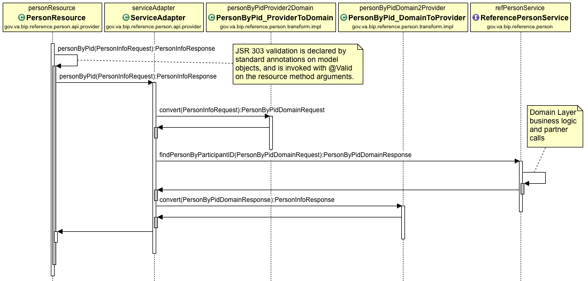
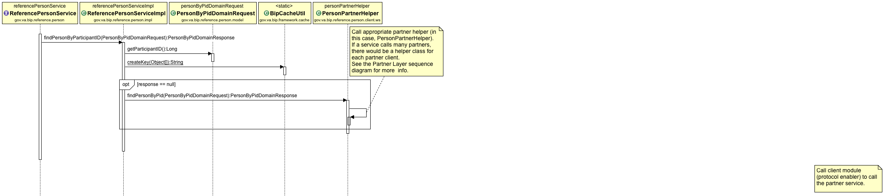

# BIP Service Application Flow
This page is primarily concerned with describing the typical flow of a service application built on the [BIP Framework](https://github.com/department-of-veterans-affairs/ocp-framework). The spring boot [Reference Person](https://github.com/department-of-veterans-affairs/ocp-reference-spring-boot) application provides a valuable example of many of the mechanics involved in preparing for development of a project.

This page does not specifically address configuration of the environment or capabilities provided by the platform. For configuration and usage, see the links at [Application Core Concepts and Patterns](https://github.com/department-of-veterans-affairs/ocp-reference-spring-boot#application-core-concepts-and-patterns).

## Overview
BIP applications can be thought of as being comprised of three layers (or "tiers"), each of which encapsulates functionality for the layer:
* Provider layer (or "web tier", or "exposed api")
* Domain layer (or "service tier", or "business")
* Partner layer (or "client layer", or "services outside this app")

The topic of layer separation is discussed in more detail in [Layer and Model Separation Design](design-layer-separation.md).

## Provider Layer
This is where the "public" API for the service application is exposed. Functions undertaken in this layer include:
* Receiving requests in one or more Resource class(es) that are annotated with `@RestController`. This class will have methods annotated with the relveant `@RequestMapping` attributes.
* Standard JSR 303 validations on inputs to the request mapping methods.
* Conversion of Provider model objects into Damain model objects, calling the service, then converting the returned domain response into a Provider model response.

#### Sequence Diagram - Provider Layer

## Domain Layer
The domain layer is where the business logic of the service takes place. Functions undertaken in this layer include:
* Business validation of data received from the Provider layer.
* Acquire additional data from Partner services (e.g. other services external to the application):
	* Convert data to the Partner's object model
	* Request data through the Partner layer client (see below)
	* Convert the Partner response back to the domain model
* Aggregate or manipulate data to the required state.
* Return resulting data to the Provider layer, communicating any issues encountered during processing of the service request.

#### Sequence Diagram - Domain Layer

## Partner Layer
The Partner layer is self-contained client modules that call out to other services to acquire data. BIP Framework currently provides support for accessing services exposed via SOAP and REST. Other protocol support can be added upon request. The functions undertaken in this layer are simple and direct:
* Receive the request from the service layer
* Assemble the protocol-specific request and call the external service partner
* Deliver the partner response back to the service layer
* Wrap request related exceptions/faults received from the partner into a BIP checked esxception. This allows the domain to catch and handle it.

Partner clients are intended to be stand-alone, and should be capable of being JAR'd and made available to *any* BIP service as a dependency. As such, one partner client could be used by many different services, for different purposes, and with different expectations. Therefore the client *must* be data transparent, and serve only as a protocol enabler. 

Some things that the Partner layer should **NOT** do - these are the responsibility of the calling service:
* Any form of translation or modification of data accepted by or returned from the partner.  The client cannot anticipate the needs of the service it is embedded within.
* Validations or filtering. The client cannot anticipate the needs of the service it is embedded within.
* Catch runtime exceptions (non-data problems). Code or infrastructure issues must bubble back to the service layers as-is, for translation by the global exception handler.

#### Sequence Diagram - Partner Layer

 