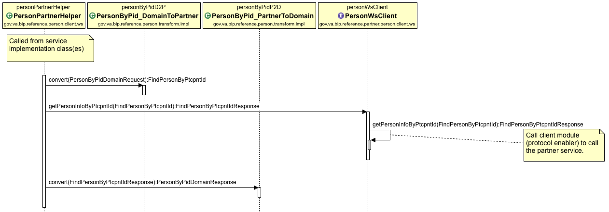

# BIP Service Application Flow
This page is primarily concerned with describing the typical flow of a service application built on the [BIP Framework](https://github.ec.va.gov/EPMO/bip-framework). The spring boot [Reference Person](https://github.ec.va.gov/EPMO/bip-reference-person) application provides a valuable example of many of the mechanics involved in preparing for development of a project.

This page does not specifically address configuration of the environment or capabilities provided by the platform. For configuration and usage, see the links at [Application Core Concepts and Patterns](https://github.ec.va.gov/EPMO/bip-reference-person#application-core-concepts-and-patterns).

## Overview
BIP applications can be thought of as being comprised of three layers (or "tiers"), each of which encapsulates functionality for the layer:
* Provider layer (or "web tier", or "exposed api")
* Domain layer (or "service tier", or "business")
* Partner layer (or "client access layer", or "calls to services outside this app")

The topic of layer separation is discussed in more detail in [Layer and Model Separation Design](design-layer-separation.md).

## Provider Layer
This is where the "public" API for the service application is exposed. Functions undertaken in this layer include:
* Receiving requests in one or more Resource class(es) that are annotated with `@RestController`. This class will have methods annotated with the relveant `@RequestMapping` attributes.
* Standard JSR 303 validations on inputs to the request mapping methods.
* Conversion of Provider model objects into Damain model objects, calling the service, then converting the returned domain response into a Provider model response.

#### Sequence Diagram - Provider Layer

## Domain Layer
The domain layer is where the business logic of the service takes place. Functions undertaken in this layer include:
* Business validation of data received from the Provider layer.
* Acquire additional data from Partner services (e.g. other services external to the application):
	* Convert data to the Partner's object model
	* Request data through the Partner layer client (see below)
	* Convert the Partner response back to the domain model
* Aggregate or manipulate data to the required state.
* Return resulting data to the Provider layer, communicating any issues encountered during processing of the service request.

#### Sequence Diagram - Domain Layer

## Partner Layer
The Partner Layer is comprised of a helper class and any other support classes needed to interact with a Partner Client module.

This layer is concerned with
1. accepting a request from the service implementation
2. transforming the service request to the partner's data model as provided by the Partner Client JAR
3. calling the Partner Client JAR to execute the request
4. transforming the response - and catching and transforming any exceptions - from the Partner Client
5. returning the response (or exception) to the service layer

The partner layer should have at least one Helper class for each partner client that is called.

For information about the Partner Client, see [bip-reference-partner-person](https://github.ec.va.gov/EPMO/bip-reference-person/tree/master/bip-reference-partner-person)

#### Sequence Diagram - Partner Layer

 